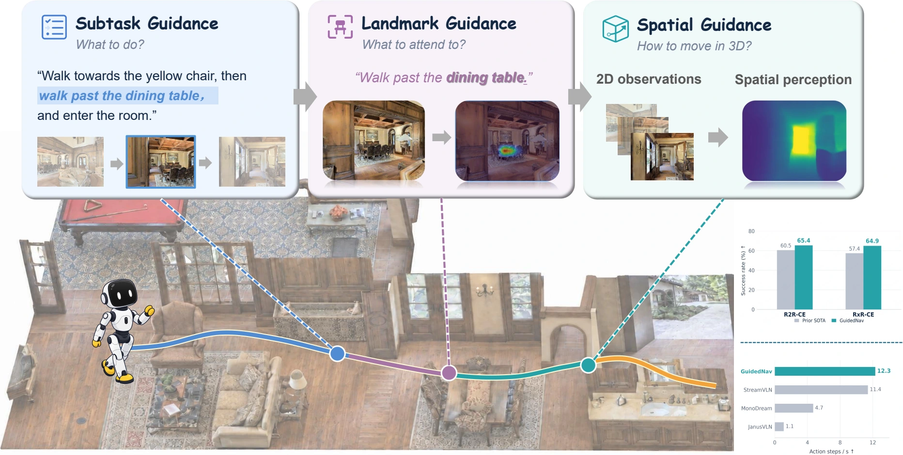

# GuidedNav: Shaping Vision-Language Navigation Representations through Pre-Action Attention and Spatial Guidance

**[Jingyu Guo](https://jingyu198.github.io/jingyu.github.io/), [Jiaxin Huang](https://huangjiaxin.mystrikingly.com/), [Chengxing Lin](https://linchengxing.github.io/), [Xiaoyu Luo](https://scholar.google.com/citations?view_op=search_authors&mauthors=Xiaoyu+Luo+University+of+Macau&hl=en), [Cheng Wen](https://scholar.google.com/citations?view_op=search_authors&mauthors=Cheng+Wen+AGIBOT&hl=en), [Shanshan Ye](https://cassie133ye.github.io/), [Tingjin Chu](https://findanexpert.unimelb.edu.au/profile/795463-tingjin-chu), [Shaoli Huang](https://shaoli-huang.github.io/), [Mingming Gong](https://mingming-gong.github.io/)**

Jiaxin Huang is the project leader. Shaoli Huang and Mingming Gong are the corresponding authors.

[Project page & demos](https://jingyu198.github.io/GuidedNav/) · [Release plan](#release-plan) · [Citation](#citation)

## Overview

[](https://jingyu198.github.io/GuidedNav/)

GuidedNav shapes the representations that connect instructions to navigation actions through three complementary designs:

- **Subtask guidance** directs native pre-action attention toward the active instruction segment.
- **Landmark guidance** grounds attention in visual regions relevant to the current objective.
- **Spatial guidance** transfers geometric information into the policy during training.

The learned policy predicts actions directly at inference. We also introduce **Guided-R2R** and **Guided-RxR**, annotation-enriched datasets with subtask intervals and landmark annotations.

Visit the [project page](https://jingyu198.github.io/GuidedNav/) for the method, original benchmark results, real-world demonstrations, and simulator rollouts.

## Release plan

The research artifacts are being prepared for release. This repository currently contains the project website; the four artifacts below are **not yet released**.

| Artifact | Planned contents | Status |
| --- | --- | --- |
| **Checkpoints (ckpts)** | GuidedNav policy checkpoints and associated configurations for R2R-CE and RxR-CE. | Planned |
| **Inference code** | Environment setup, checkpoint loading, navigation inference, and benchmark evaluation scripts. | Planned |
| **Datasets** | Guided-R2R and Guided-RxR annotations, format documentation, and data preparation instructions. | Planned |
| **Training code** | Training implementation, guidance objectives, configurations, and reproduction instructions. | Planned |

Download links and usage instructions will be added here as each artifact is released.

## Citation

```bibtex
@misc{guo2026guidednav,
  title={GuidedNav: Shaping Vision-Language Navigation Representations
         through Pre-Action Attention and Spatial Guidance},
  author={Jingyu Guo and Jiaxin Huang and Chengxing Lin and Xiaoyu Luo
          and Cheng Wen and Shanshan Ye and Tingjin Chu
          and Shaoli Huang and Mingming Gong},
  year={2026},
  url={https://jingyu198.github.io/GuidedNav/}
}
```

## Website maintenance

- Edit `app/homepage.html` for page content and `app/globals.css` for styling.
- Store figures, posters, videos, and the walking mascot script in `public/`.
- Run `npm run build`, then `npm run export:pages` to regenerate `docs/`.
- Commit the source and generated `docs/`, then push `main`.

GitHub Pages publishes `main` from `/docs`. The site uses native video controls with no video preload. Benchmark figures reproduce the original paper tables and plots.

The real-world clips display their original instructions. Simulator rollouts currently include R2R episodes 1190 and 1288; RxR model rollout captures are pending. Dataset annotation videos remain in the dataset section. `media-manifest.json` records the selected media and task boundaries.

The GuidedNav wordmark uses orderly lettering with dimensional teal coloring and an AgiBot X2-inspired walking mascot.

Xiaoyu Luo and Cheng Wen currently link to Google Scholar author searches; the other authors link to verified personal or university pages.
